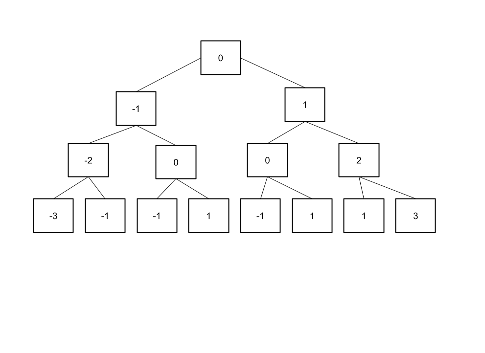

# Tree Generation Algorithm

## Problem:

- Given input n, generate and return a full row of depth n from a binary tree given rule sets rule_left and rule_right when nodes are in relation
- Currently algorithm is very inefficent, $\theta (2^n)$ with usually some form of creating each depth prior to n.

## Current State of Algorithm:

### Tasks Done:
- [X] Find patterns or subsequences to save computation time
- [X] Develop sequence that works and generates correct values for each tree node in given depth
  - [ ] Provide Tree row where left and right function ordering is important
- [ ] Find way to reduce runtime past the $\theta (2^n)$ used to create the array of size $2^n$

## Algorithm Explaination V1.0:

Let us use an example of left rule set is value - 1, and right rule set is value + 1. Now lets run our function tree_gen(3).

The final tree would be something like this:

Now abstracting this to left and right, we notice the graph can be formatted like the image below.

Taking that row of data we can then process depth = 3 row as 

[0, 1, 1, 2 , 1, 2, 2, 3] , where int values represent the # of times the right function is called

Notice how [0,1,1, 2] the first half of this array is similar to the other half in which its one less

Hence instead of having to compute the values for each row prior, we build from the left, with the rules:

- if k elements are filled and k is a power of 2
  - Then duplicate k and take the duplucated amount and add 1 to all the values
- Initial conditions is that the 1st term in the array must be [0], unles this changes in future versions, this assumption allows us to build a singular 2^n array in linear time respective to array size instead of having to recursively call up the tree to compute the values.

